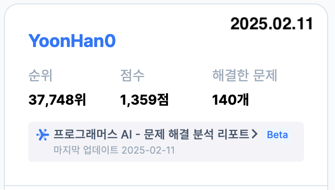
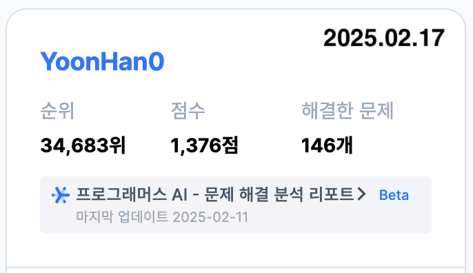
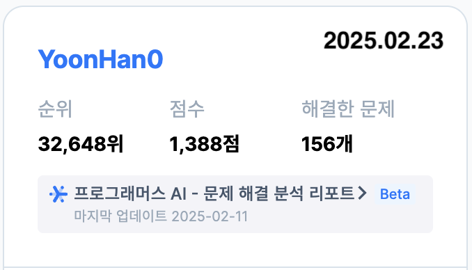

# one-day-one-code
하루에 알고리즘 한 문제씩 꾸준히 풀어보자🔥

- 프로그래머스, 백준 등에서 문제를 풀이
- 일주일씩 진행 상황을 리포트
- 사용언어: JS, Java

 

### 내용 정리
[알고리즘 문제를 풀면서 알게 된 문법들 정리](./algorithm-folder/java-note/arrayList-note.md)  
[자바 메서드 사용법](algorithm-folder/java-note/자바_메서드_사용법.md)

 

### 프로그래머스

